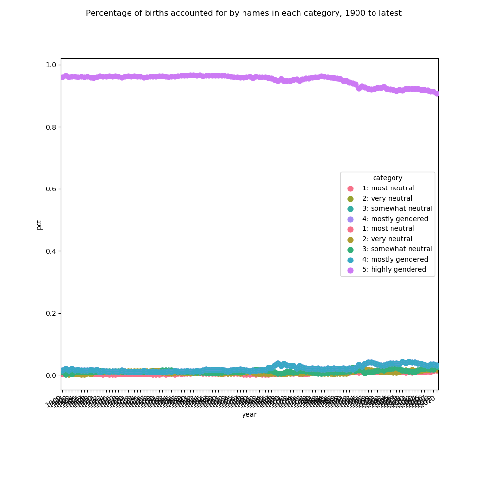

# Are gender-neutral names becoming more common?

## Data source

Below uses United States Social Security Administration data [available from SSA.gov](https://www.ssa.gov/oact/babynames/limits.html). The dataset labeled `National data` was used. It contains first names only. Per SSA, "All names are from Social Security card applications for births that occurred in the United States."

## High-level process

- calculate percentage of births accounted for by each name in each year of birth (YOB)
- calculate f:m ratio for each name in each YOB
- categorize names as most neutral (1) to highly gendered (5)
- aggregate (sum) by YOB and category

## Do babies given gender-neutral names account for an increasing percentage of births?

Yes. While the vast majority of babies are still given gendered names, the percentage given gender-neutral names is up from about 4% in 1900 to about 9% in 2020.

### Percentage of births accounted for by names in each category, 1900 to latest

### Percentage of births accounted for by gender-neutral names in each category, 1900 to latest

### Summary

YOB: 1900

| year | category | pct |
| ----- | ----- | ----- |
| 1900 | 1: most neutral | 0.003 |
| 1900 | 2: very neutral | 0.011 |
| 1900 | 3: somewhat neutral | 0.009 |
| 1900 | 4: mostly gendered | 0.016 |
| 1900 | 5: highly gendered | 0.96 |

YOB: 2020

| year | category | pct |
| ----- | ----- | ----- |
| 2020 | 1: most neutral | 0.016 |
| 2020 | 2: very neutral | 0.019 |
| 2020 | 3: somewhat neutral | 0.027 |
| 2020 | 4: mostly gendered | 0.032 |
| 2020 | 5: highly gendered | 0.907 |

---

# Most common gender-neutral names for each year of birth

See the [`neutral_names_by_yob`](neutral_names_by_yob) folder for data files corresponding to each year.

