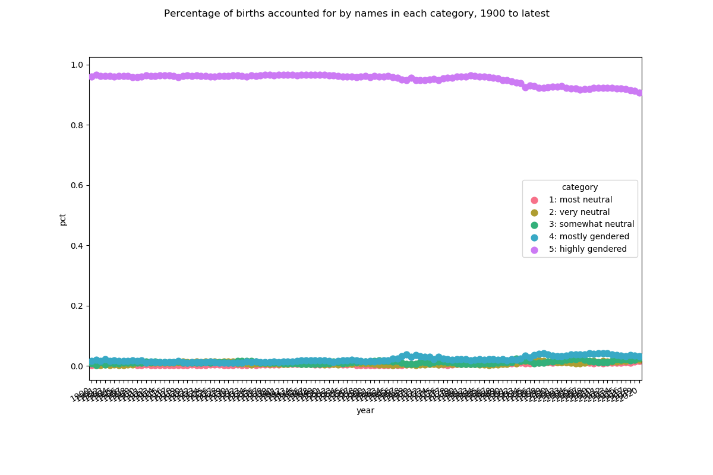
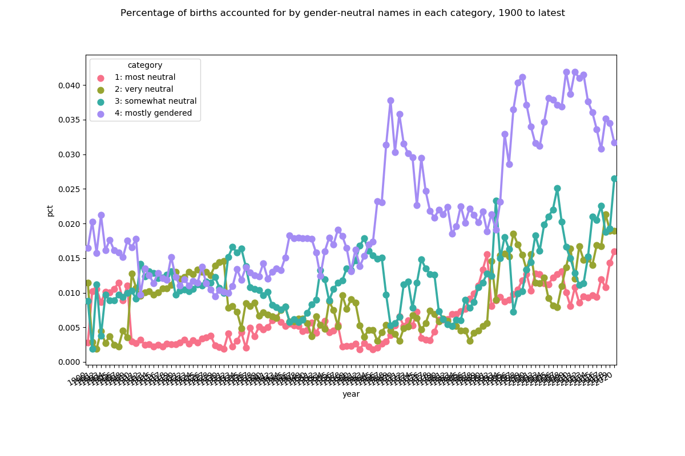

# Are gender-neutral names becoming more common?

## Data source

Below uses United States Social Security Administration data [available from SSA.gov](https://www.ssa.gov/oact/babynames/limits.html). The dataset labeled `National data` was used. It contains first names only. Per SSA, "All names are from Social Security card applications for births that occurred in the United States."

## High-level process

- calculate percentage of births accounted for by each name in each year of birth (YOB)
- calculate f:m ratio for each name in each YOB
- categorize names as most neutral (1) to highly gendered (5)
- aggregate (sum) by YOB and category

## Do babies given gender-neutral names account for an increasing percentage of births?

Yes. While the vast majority of babies are still given gendered names, the percentage given gender-neutral names is up from about 4% in 1900 to about 9% in 2020.

### Percentage of births accounted for by names in each category, 1900 to latest

### Percentage of births accounted for by gender-neutral names in each category, 1900 to latest

---

# "Opposite-gendered" name trends

While the trend varies from one year to the next, it's more common for baby girls to be given masculine names than it is for baby boys to be given feminine names (with "masculine" and "feminine" defined by the "highly gendered" category from above).

